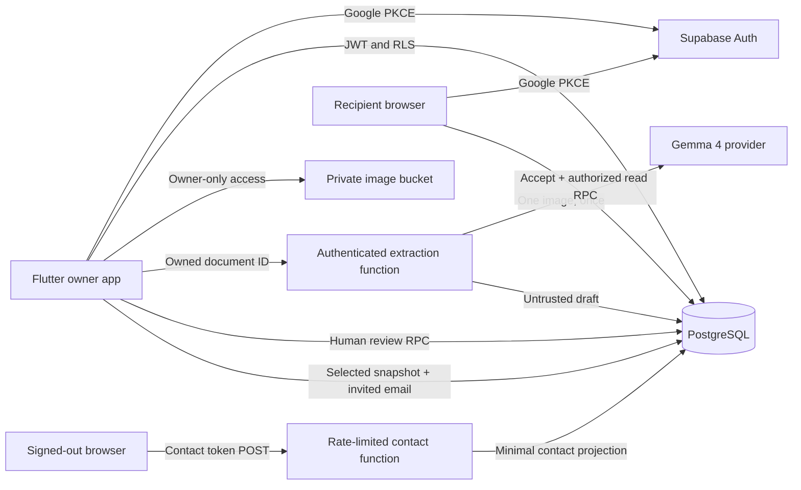

# Architecture

App records and session keys have separate lifetimes. Medical records remain in
memory on mobile and browser; Android sessions and PKCE verifiers use secure
storage. Android backups are disabled and FLAG_SECURE limits screenshots and
recent-app previews. Images chosen from the user's gallery are outside Kin's
control. No encrypted local medical repository is implemented.

The database derives ownership from `auth.uid()`. Clients can insert owned
document metadata and read owned rows. Review, publish, sharing, contacts and
deletion use narrowly scoped RPCs. Recipient access goes through an explicit
projection; recipients cannot select the private tables directly.

Each invitation stores a snapshot of the selected summary, a hashed 256-bit token,
an intended email and a deadline fixed at creation + 24 hours. Acceptance requires
a confirmed Google identity and matching email, then binds the recipient user ID.
Every read checks that ID, expiry and revocation. Browser reads every 15 seconds
while visible; local expiry clears the UI immediately. Hiding the tab clears the
medical display. A failed authorization/network check clears it too.

Reviewing or deleting a source conservatively clears all published medicines and
revokes all existing medical shares. The owner must publish and share again.
Editing an unrelated source therefore also invalidates existing medical shares.
This is intentional MVP behavior to avoid stale source-backed snapshots.

One clear typed English image is sent to Gemma at ingestion, not during lookup.
Returned JSON is bounded, validated and held as a draft. There are no embeddings,
vector search, tools or autonomous clinical agents. History is a parameterized
owner-only SQL query over reviewed medicine/date metadata.

Render hosts the static receiver under HTTPS. Supabase hosts APIs, auth, storage
and functions. DigitalOcean inference is the preferred optional live AI provider;
Google-hosted Gemma is a fictional-only alternative subject to its terms. Neither
live integration is claimed as tested until a real provider call succeeds.
